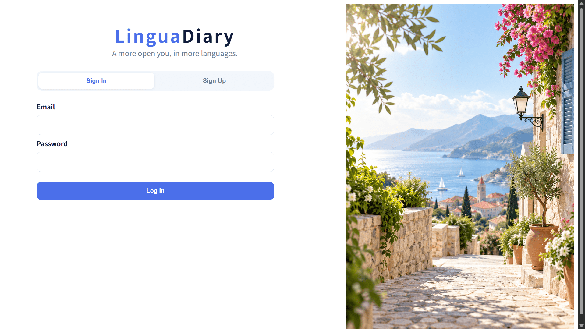
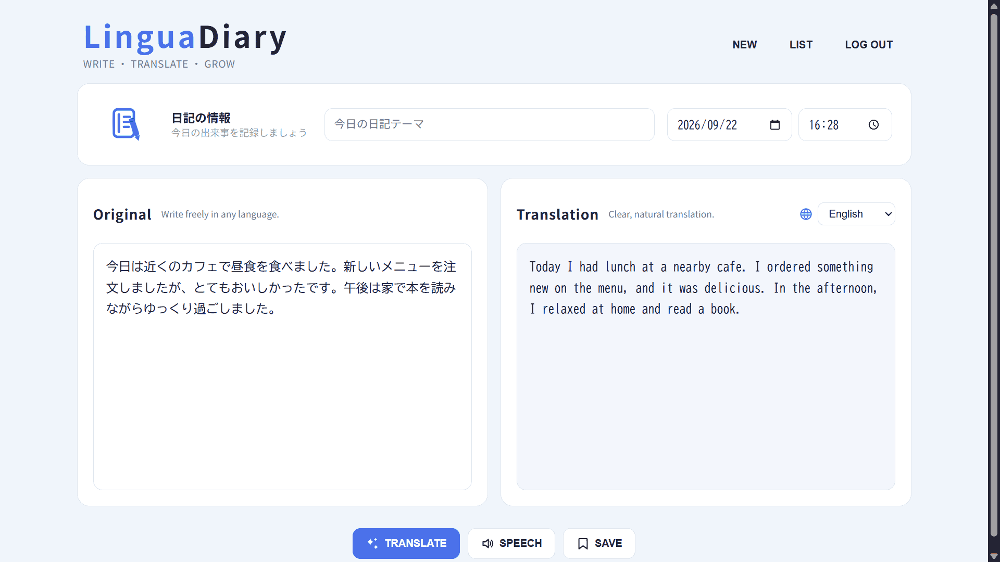
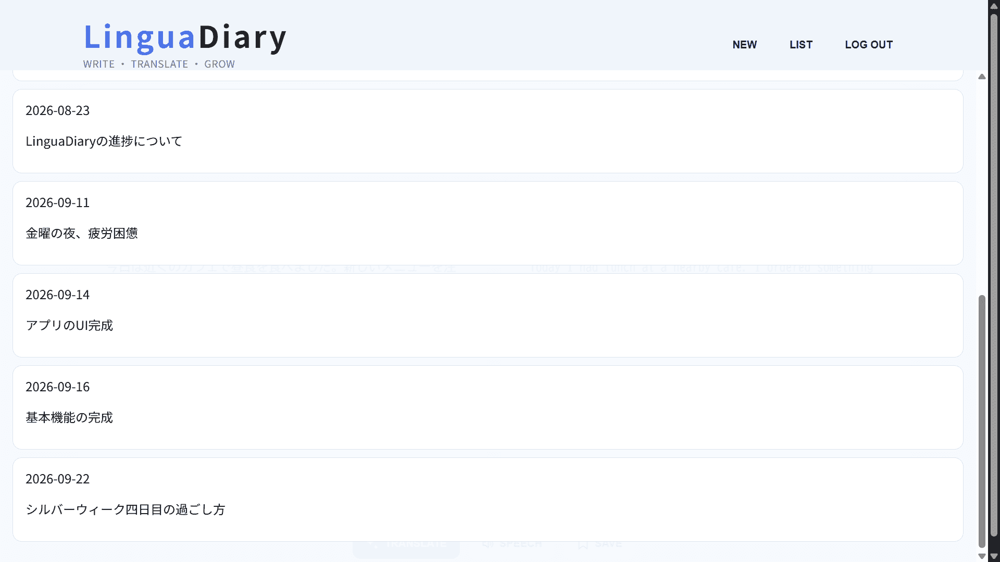
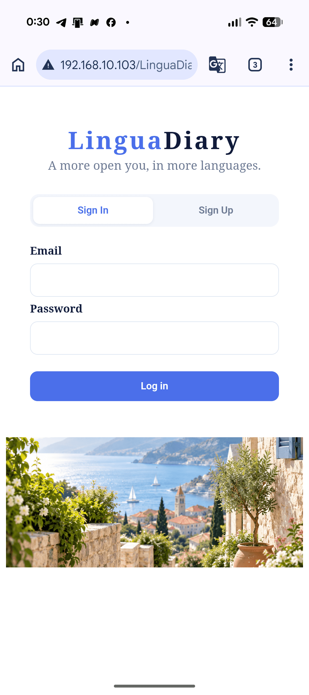
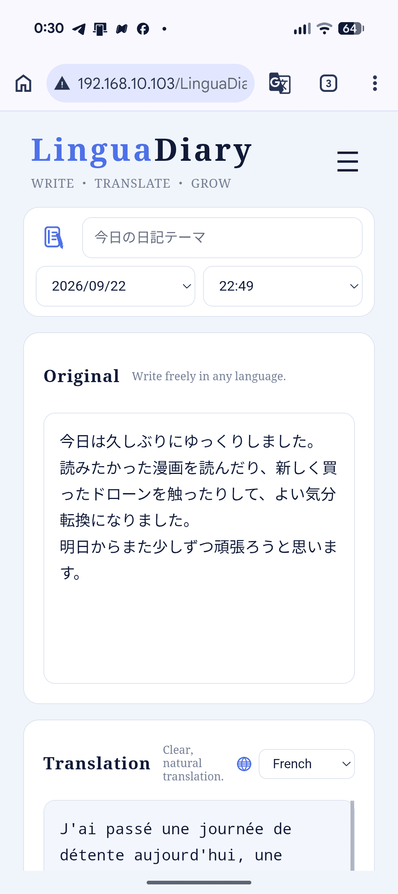
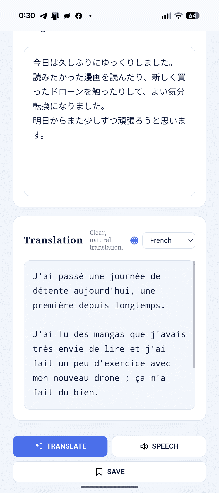

# LinguaDiary

アプリ概要:
自国語で日記を書き、その内容を翻訳・音読することで日々の記録を続けながら書きながら語学学習ができるアプリです。

## Features
主な機能：
ログイン・ログアウト、日記記入、英語、フランス語、イタリア語、ドイツ語、ウクライナ語、日本語、韓国語、中国語への翻訳と音読、日記本文とその翻訳文の保存・編集・削除

## Tech Stack
使用技術：
HTML,CSS,JavaScript,PHP,MySQL,MariaDB

## Highlights
工夫した点:
誰でも迷わずに使えるようにシンプルなレイアウトを心がけました。
操作が適切に行えたか判断できるように、保存や更新、削除の後にメッセージが表示されるようにしましたた。
特に削除については削除ボタンを押した後にすぐに削除されるのでなく確認をとるようにしました。
パソコンとスマホそれぞれで見やすいようにレスポンシブデザインを用いました

## Future Improvements
今後の改善点：
アイデアが思いつき次第更新予定です。

## Screenshots

<h3>Desktop</h3>

### Mobile

